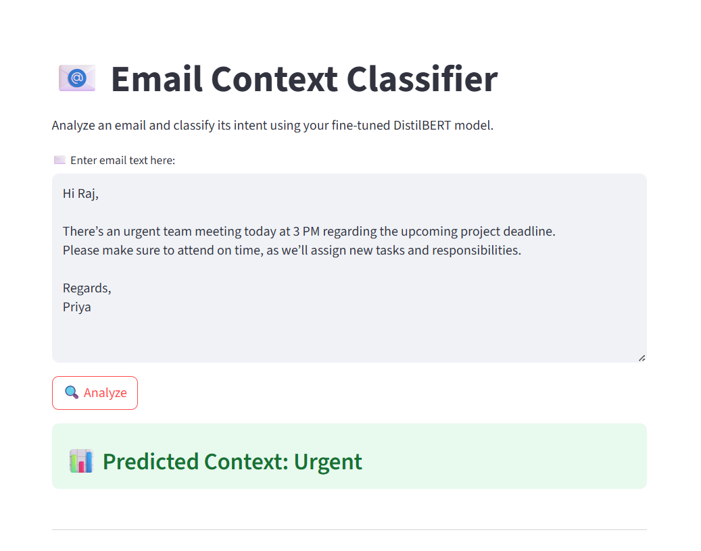
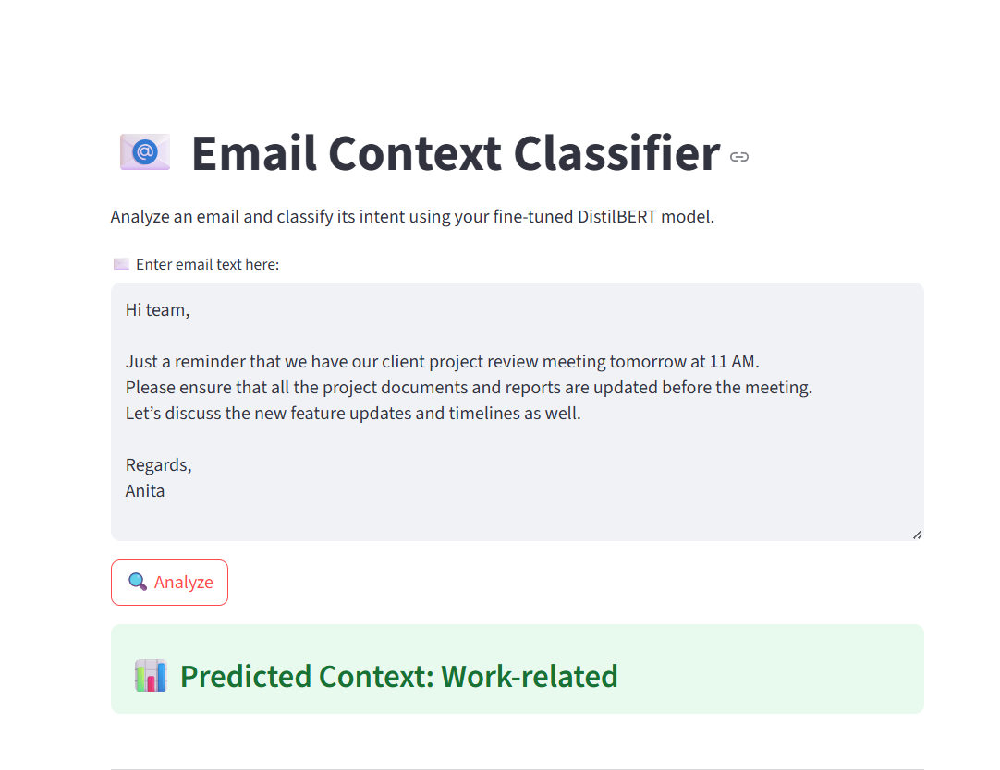
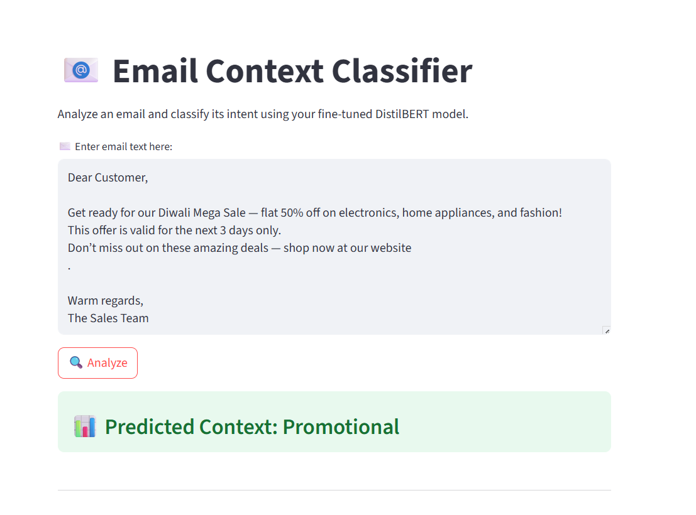
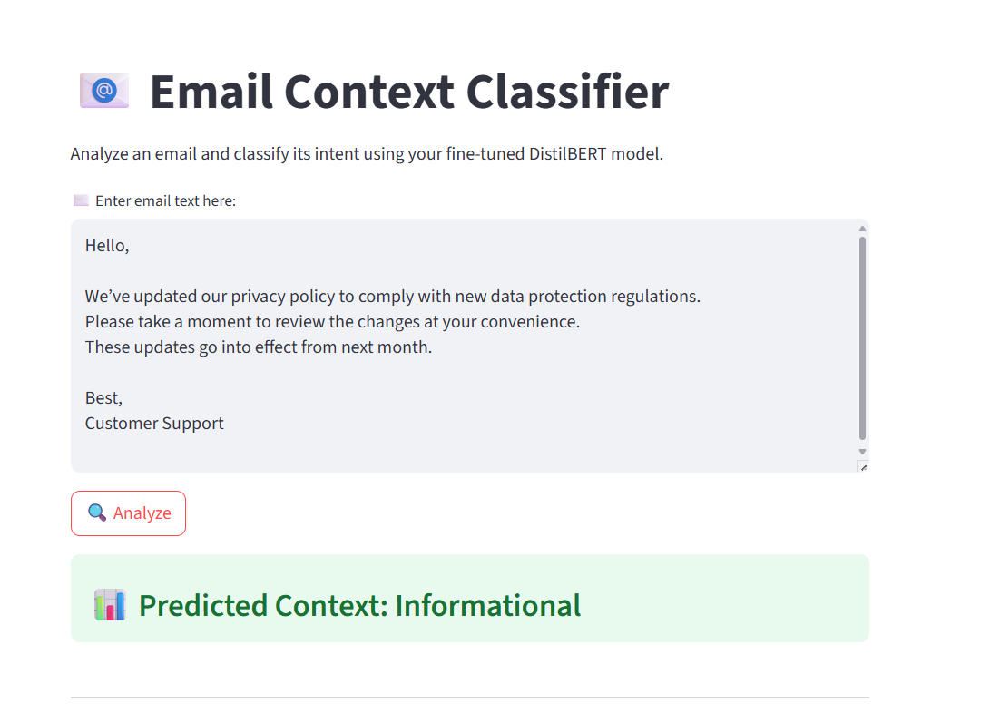

## 📧 MailMind: Context-Aware Email Classifier

MailMind is an AI-powered email classification app that uses a fine-tuned DistilBERT model to understand the intent and context of an email.
It can detect whether an email is Urgent, Work-related, Informational or Promotional, helping users quickly prioritize their inbox.

Built with Streamlit for a seamless web interface and optionally optimized with OpenVINO for lightning-fast inference.

## 🖼️ Model Output

Here’s how the **Urgent** email classification looks:

Here’s an example of a **Work-related** email:

Here’s a **Promotional** email sample:

And finally, an **Informational** email example:

#### 🧠 Tech Stack
##### Frontend	-  Streamlit
##### Backend / ML	- PyTorch, Transformers (Hugging Face)
##### Language	-  Python 3.11+

#### 🚀 Features

#### ✅ Real-time Email Classification
Analyze email text instantly and get predicted context labels like Urgent, Work-related, Informational or Promotional.

#### 🧠 Transformer-based NLP
Leverages a fine-tuned DistilBERT model for context-aware text understanding.

#### 🎨 Streamlit Web App
An interactive and user-friendly web interface to test the model without code.

#### 🧩 Rule-based Enhancements
Keyword-based checks for words like urgent, immediately, or meeting for improved classification.

